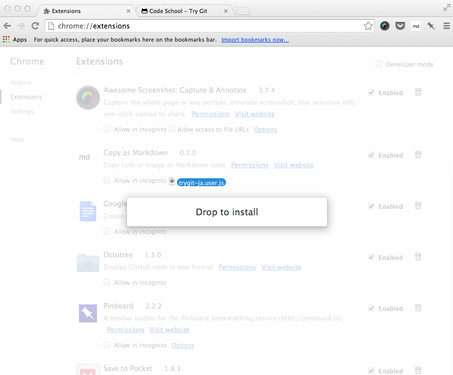

trygit-ja.user.js
=================

User script to translate [Code School - Try Git](https://try.github.io/) into Japanese.

## How to use

Drag and drop `trygit-ja.user.js` into your `chrome://extensions` window.

After install this script, you can see the translated content when you go
[Code School - Try Git](https://try.github.io/).
